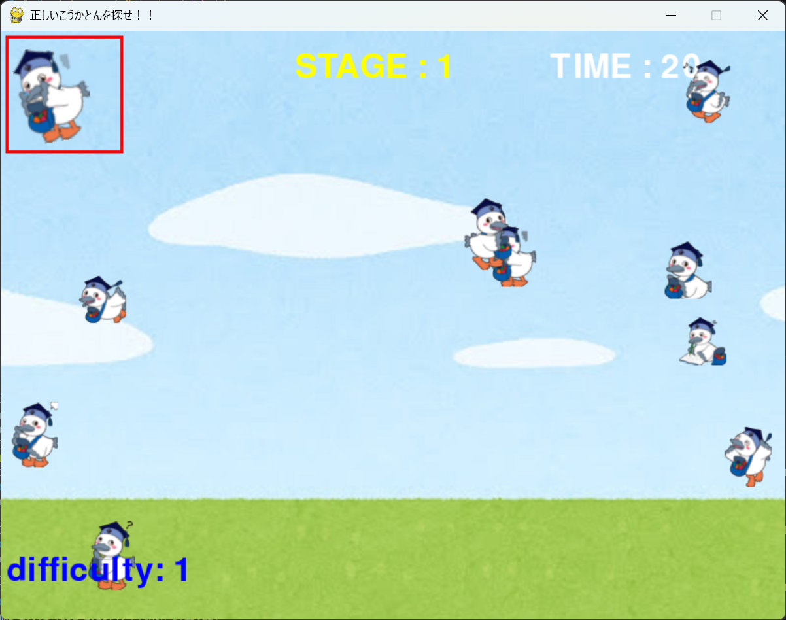

# 正しいこうかとんを探せ!!

## 実行環境の必要条件
* python >= 3.13.12
* pygame >= 2.6.1

## ゲームの概要
* 正しいこうかとんの画像をクリックしてより多くのステージをクリアする
* 参考URL：[ミニゲーム - New スーパーマリオブラザーズ](https://www.nintendo.co.jp/ds/a2dj/minigame/index.html)

## ゲームの遊び方
* 表示されたこうかとんと同じこうかとんを見つけてクリックする
* 正解することができたら難易度が上がる、不正解はそのまま続行
* 制限時間を超えたらゲームオーバー

## ゲームの実装
### 共通基本機能
* 背景画像とこうかとんの画像生成

### 分担追加機能
* 制限時間、ステージ（担当：斉藤）：制限時間機能、ステージ機能を作成した。
制限時間機能は画面右上に表示。初期値:30秒。ステージをクリアするとクリアボーナスとして残り制限時間に+2秒。
ステージ機能は画面中央上部に表示。クリアするとステージ数が1ずつ増加。
* エンドレス（担当：田仲）：正解のこうかとんをクリックしたらクリア画面を表示して自動的に次の新しいステージを生成、開始する機能。中断することなく、無限にゲームを継続できる。
* レベルアップ（担当：古川）：問題をクリアするにつれ難易度が上がる()機能を実装する
* スタート画面、結果表示画面（担当：大窪）：スタート画面とどこのステージまでクリアできたのか最終画面で表示する機能
* BGM追加（担当：川島）：ゲームの裏でBGMを流す機能

### ToDo
* 不正解を選んだらそのこうかとんが爆発する機能
* 難易度が上がるごとに背景やBGMが変化する機能
### メモ
* ステージリセットのためのreset_stageという関数を作成した
* エンドレスが分かりやすいようにクリア画面を追加している
